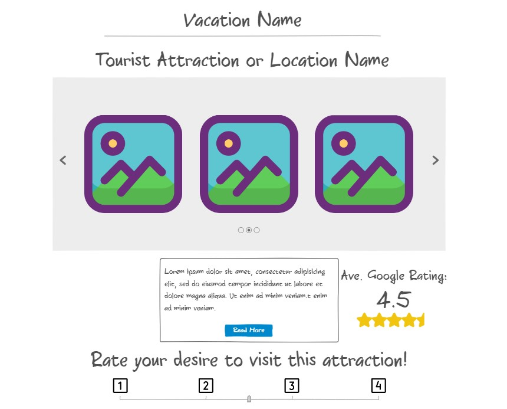

## CS260-Startup

Startup application to demonstrate the use of HTML, CSS, JavaScript, calling web services, providing web services, authentication, storing data persistently, and using web sockets for sending realtime data to and from your server.

# Personal Trip Planner

Initial idea: vacation planner to make picking locations to visit quicker and easier.

## Specification Deliverable

### Elevator Pitch

Always wanted to plan a trip, but the upfront effort to actually plan the whole thing is too much? The Personal Trip Planner is here to change that! The Personal Trip Planner, or PTP, will give you popular locations from your destination along with an average rating from those who've visited those location on their own trips. From these popular locations, you can give them a 'desire to visit' rating and store them in your itinerary page. Once you've finished picking your favorites, you can specify what days you want to visit them and the PTP will put them onto a calendar for you and you're done! Instead of hunting for every location you want to go on your trip, they came to you in one easy place and you're ready to pack your bags and book a plane ticket!

### Design

Example of what the destination rating page might look like.

### Key Features

- Secure login over HTTPS
- Ability to select destinations and rate desire to visit
- Choices and preferences are persistenly stored
- Sorts and displays saved choices and preferences
- Ability to create an itinerary on a calendar

### Technologies

I plan to use these technologies in the following ways:

- **HTML** - Uses correct HTML structure for application. Two HTML pages. One for login and one for voting. Hyperlinks to choice artifact.
- **CSS** - Application styling that looks good on different screen sizes, uses good whitespace, color choice and contrast.
- **JavaScript** - Provides login, choice/rating display, applying ratings into a sorted list, apply top choices to calendar, backend endpoint calls.
- **Service** - Backend service with endpoints for:
  - login
  - retrieving choices
  - submitting ratings
  - retrieving and sorting choices by rating
- **DB/Login** - Store users, choices, ratings, and calendars in database. Register and login users. Credentials securely stored in database. Can't share calendars unless authenticated.
- **WebSocket** - Calendars can be shared with other users, specified location/dates will show up on each user's calendar.
- **React** - Application ported to use the React web framework.
